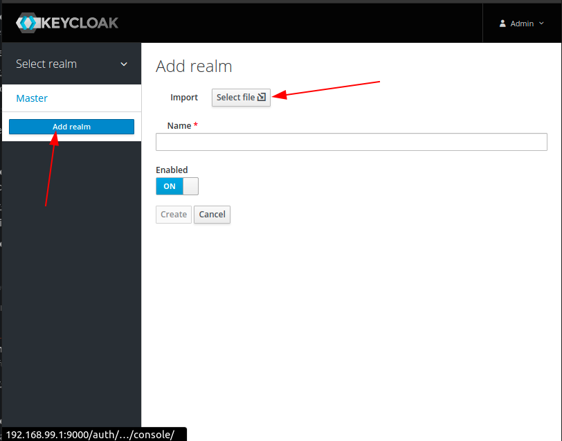
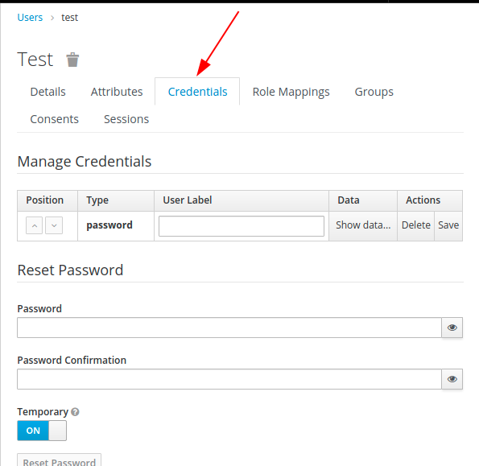

# **Keycloak IDM**

[Keycloak](https://www.keycloak.org/) as Identity and Access Management Provider

## **Author**

Jorge Alvarez <alvarez.jeap@gmail.com>

## **Requirements***

- Docker 19+

## **Playground**

- Add alias IP `192.168.99.1` to loopback inteface

- Run application

```sh
./run.sh
```

- Open [http://192.168.99.1:9000](http://192.168.99.1:9000)

  - Default username and password `admin:admin`

- Create a new `realm` from importing [demo-realm.json](./keycloak/demo-realm.json) file

  

- You will see an new realm called `jconf2020` with some default clients used by the demo applications

  - keycloak-profile-plane-js-ui
  - keycloak-user-profile-ui
  - todo-app-api
  - todo-app-ui

- Create a new user under `Users` option. Once the user has been created change the default password.

  
